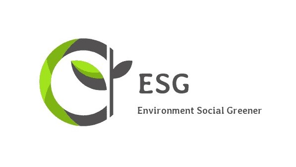

---

## 건강과 환경 상관관계 분석 및 시각화

> 참여 :  [jaywoong](https://github.com/jaywoong) (기획, 데이터 전처리 및 분석),  [mmeooo](https://github.com/mmeooo) (웹 구현, 데이터 전처리 및 시각화)
>
> 기간 : 2021.10.18 ~ 2021.11.10


## :star: 최종 구현

###  &nbsp;**[웹페이지](http://jaeung.pythonanywhere.com/)**


##  :pushpin: **Index**

> **:mag: [Overview](#idx1)** 
>
> **:scissors: [Preprocessing](#idx2)**  
>
> **:bookmark_tabs: [Data Analysis](#idx3)**
>
> **:bar_chart: [Visualization](#idx4)**
>
> **:bulb: [Business Proposal](#idx5)**

___


## :mag: Overview <a id="idx1"></a>

### :one: 주제

**지역사회 건강결과 및 건강결정요인 데이터와 지역별 상수도 수질, 대기질 데이터를 활용하여 환경이 지역사회 건강에 끼치는 영향을 분석하고 활용방안을 탐색한다.**


### :two: 필요성 

**세계적으로 많은 사람들이 환경오염으로 인해 발생하는 건강 문제에 고통받고 있다. 저소득 국가일수록 또는 저소득 계층일수록 환경오염으로 의한 질병에 취약하다. 오염은 단지 자연보호 차원의 문제가 아니며, 인간의 복지와 건강에 영향을 미치는 심각하고, 전반적인 문제가 되었다. 오염, 빈곤, 취약한 건강, 사회적 불평등은 모두 긴밀히 연관된 문제이기에, ESG의 중요성이 대두되는 지금, 우리는 환경과 건강에 대해 이해하고 함께 고민해야 한다. 환경오염 요인 중 가장 많은 사망자를 야기하는 심각한 문제로 대기오염과 수질오염이 있다. 따라서 대기질과 수질의 변화 양상 및 건강에 미치는 영향을 시각화하여 경각심을 제고하고, 사회 문제에 대한 해결 방안을 제시한다.**


### :three: 데이터

| 데이터                             | 사이트               | 링크                                                |
| ---------------------------------- | -------------------- | --------------------------------------------------- |
| 지역사회 건강 결과 및 건강결정요인 | 질병관리청           | https://chs.kdca.go.kr/chs/recsRoom/dataBaseMain.do |
| 지역별 상수도 수질 데이터          | 국가상수도정보시스템 | https://www.waternow.go.kr/web/lawData?pMENUID=4    |
| 지역별 대기질 데이터               | 국가통계포털         | https://kosis.kr/index/index.do                     |


### :four: 주요 기능

- 건강 데이터 시각화
- 환경(대기질, 수질) 데이터 시각화
- 환경과 건강 상관관계 시각화
- 분석 활용 및 문제 해결 방안


### :five: 개발 환경 및 도구


- 분석 라이브러리로 Pandas, Numpy, Sikit-Learn 사용


## :scissors: Preprocessing <a id="idx2"></a>

### :one: 건강 데이터 전처리


- 지역사회 건강결과 및 건강결정요인 데이터에서 필요한 컬럼만 추출한 후, 위와 같은 과정을 통해 태블로에서 시각화하기 좋은 형태로 변환 


### :two: 대기질 데이터 전처리


(Min-Max 정규화 과정 생략)


- 5개의 대기질 지표 데이터를 병합하고 태블로에서 시각화하기 좋은 형태로 변환 


### :three: 수질 데이터 전처리

(컬럼 선택 및 결측치 제거 과정 생략, [코드 보기](./myanalysis/Preprocessing_Water.ipynb))


- 각 지역별 1년 평균 물질 농도를 계산하고 측정 단위를 통일하는 함수

(Min-Max 정규화 과정 생략)


- 정규화된 수질 지표 데이터를 태블로에서 시각화하기 좋은 형태로 변환


## :bookmark_tabs: Data Analysis <a id="idx3"></a>

### :one: Multi Leaner Regression


- 다중 선형 회귀분석(Multi Leaner Regression)을 통해 전체 수질 지표와 건강지표 간의 상관관계 확인


### :two: Variable Selection

``` python
variables = df.columns.tolist() ## 설명 변수 리스트
 
## 반응 변수 = 'y의 컬럼들'
selected_variables = [] ## 선택된 변수들
sl_enter = 0.05
sl_remove = 0.05
 
sv_per_step = [] ## 각 스텝별로 선택된 변수들
adjusted_r_squared = [] ## 각 스텝별 수정된 결정계수
steps = [] ## 스텝
step = 0
for i in range(0,6):
    y = df_y.iloc[:,i]
    y = list(y)
    while len(variables) > 0:
        remainder = list(set(variables) - set(selected_variables))
        pval = pd.Series(index=remainder) ## 변수의 p-value
        ## 기존에 포함된 변수와 새로운 변수 하나씩 돌아가면서 
        ## 선형 모형을 적합한다.
        for col in remainder: 
            X = df[selected_variables+[col]]
            X = sm.add_constant(X)
            model = sm.OLS(y,X).fit()
            pval[col] = model.pvalues[col]

        min_pval = pval.min()
        if min_pval < sl_enter: ## 최소 p-value 값이 기준 값보다 작으면 포함
            selected_variables.append(pval.idxmin())
            ## 선택된 변수들에대해서
            ## 어떤 변수를 제거할지 고른다.
            while len(selected_variables) > 0:
                selected_X = df[selected_variables]
                selected_X = sm.add_constant(selected_X)
                selected_pval = sm.OLS(y,selected_X).fit().pvalues[1:] ## 절편항의 p-value는 뺀다
                max_pval = selected_pval.max()
                if max_pval >= sl_remove: ## 최대 p-value값이 기준값보다 크거나 같으면 제외
                    remove_variable = selected_pval.idxmax()
                    selected_variables.remove(remove_variable)
                else:
                    break

            step += 1
            steps.append(step)
            adj_r_squared = sm.OLS(y,sm.add_constant(df[selected_variables])).fit().rsquared_adj
            adjusted_r_squared.append(adj_r_squared)
            sv_per_step.append(selected_variables.copy())
        else:
            break
    print(selected_variables)```
```

- 전진 단계별 선택법을 통해 각 건강 지표와 상관관계가 높은 대기질, 수질 지표 파악


- 변수 선택법을 통해 선택된 변수로 MLR 수행한 결과 


## :bar_chart: Visualization <a id="idx4"></a>

### :one: 건강 데이터 시각화


* 지도에서 원하는 지역을 선택하면  그 지역에 대한 인구통계, 의료인프라, 질병 등 다양한 데이터를 한눈에 파악할 수 있도록 Tableau를 활용해 시각화.

* 지도를 기준으로 좌측엔 지역별 남녀 인구수, 연령대별 인구수, 의료 인프라 수 시각화.

* 지도를 기준으로 우측엔 정신건강 발생수, 호흡기질환 발생수, 수인성질병 발생수의 10년간 변화 시각화.

  

  

### :two: 환경 데이터 시각화


* 수질지표와 환경배출량(폐수방류량, 유기물질부하량방류량) 간 상관관계 파악 가능.
* 대기질지표와 환경배출량(화학물질배출량, 발암우려물질배출량) 간 상관관계 파악 가능.


### :three: 건강과 환경 상관관계 시각화


* 지역별 정신건강 지표의 10년간 변화를 한눈에 확인할 수 있게 시각화.
* 정신건강 지표와 수질지표, 대기질지표 간 상관관계 파악 가능. 


* 지역별 호흡기질환 발생수의 10년간 변화를 한눈에 확인할 수 있게 시각화.
* 호흡기질환과 수질지표, 대기질지표 간 상관관계 파악 가능.


* 지역별 수인성질병 발생수의 10년간 변화를 한눈에 확인할 수 있게 시각화.
* 수인성질병과 수질지표, 대기질지표 간 상관관계 파악 가능.


## :bulb: Business Proposal <a id="idx5"></a>

**1. 보험사 - 고객들에게 환경이 좋은 지역에 있는 요양원, 실버타운을 직접 연계 해주거나, 해당 시설에 입주할 경우 인센티브를 부여한다.**

**2. 건설사 - 노령인구 증가와 건강에 대한 관심이 높아짐에 따라, 의료 인프라가 잘 갖추어져 있으며 좋은 환경을 가진 지역에 거주를 희망하는 고객이 늘어나는 상황이다. 주거시설 건축시 입지 선정을 위한 참고자료 또는 분양시 마케팅 자료로 활용한다.**

**3. 요양원 - 요양원, 실버타운 입지 선정시 근거 자료 또는 마케팅 자료로 활용한다.**

**4. 기타 제조업 - 환경과 사회를 위해 대기오염, 수질오염 유발 물질의 배출을 감축하는 노력을 강조하며, 기업의 ESG 평가 및 홍보 자료로 활용한다.**
